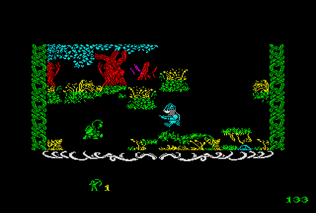

# uknc-robinofthewood

Porting Robin of the Wood game from ZX Spectrum to UKNC.

### Project Status

Work in Progress.

### Code Structure

 - `ROBIN1.MAC`: system-specific code, PPU code etc.
 - `ROBINCOR.MAC`: game logic (also holds the world map and room-index tables)
 - `ROBINFNT.MAC`: font glyphs (the HUD/message font)
 - `ROBINGFN.MAC`: wide-class sprite glyph font
 - `ROBININD.MAC`: HUD icons, message icons, ornaments and screen messages
 - `ROBINRBL.MAC`: room blocks
 - `ROBINRMX.MAC`: additional room elements
 - `ROBINRTP.MAC`: room type descriptors
 - `ROBINSPR.MAC`: sprite frame data and animation frame lists
 - `VERSIO.MAC`: build version string

### Tools

 - [macro11](https://gitlab.com/Rhialto/macro11) cross-compiler
 - [pclink11](https://github.com/nzeemin/pclink11) cross-linker
 - [UKNCBTL utilities](https://github.com/nzeemin/ukncbtl-utils): `rt11dsk` to work with disk images

Emulators of the machine, to test the result:
 - [UKNCBTL](https://github.com/nzeemin/ukncbtl)
 - UKNCBTL CLI debugger

### Credits

Original game by Odin Computer Graphics for ZX Spectrum.

This port Co-Authored-By: Claude Sonnet 5

### See Also

 - [Robin of the Wood ZX Spectrum disassembly](https://nzeemin.github.io/skoolkit-game-revs/robinofthewood-zx/robin/)
